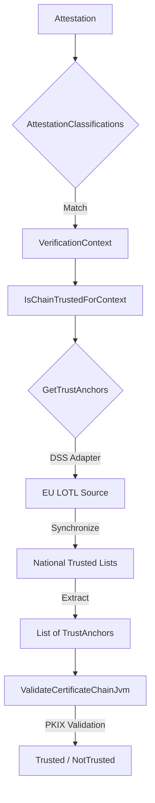

# DSS Consultation Module

This module provides abstractions and implementations for validating certificate chains against trust anchors that are
published in [ETSI TS 119 612 Trusted Lists](https://www.etsi.org/deliver/etsi_ts/119600_119699/119612/02.04.01_60/ts_119612v020401p.pdf).

Trusted Lists are fetched, parsed, and validated using [Digital Signature Service (DSS)](https://github.com/esig/dss).

The module automates the process of fetching and verifying the 
European List of Trusted Lists (LOTL). 
It wraps the stateful DSS `TLValidationJob` into the library's functional `GetTrustAnchors` interface.

🔄 **Multi-Tier Caching Strategy**
The library implements a robust three-tier caching strategy to ensure the 
Wallet remains performant and offline-capable:

- **In-Memory** (AsyncCache): Results are cached in RAM (e.g., for 10 minutes) to handle concurrent validation requests without re-parsing.
- **File System** (FileCacheDataLoader): Persists the LOTL/TL data on the device (e.g., for 24 hours), enabling offline validation.
- **Source of Truth**: The official European Commission remote URL, fetched only when the file cache expires.

## Architecture Overview


## Quick Start

```kotlin
// Setup DSS options with a 24-hour file cache
val dssOptions = DssOptions.usingFileCacheDataLoader(
    fileCacheExpiration = 24.hours,
    cacheDirectory = Paths.get(cachePath)
)

// Define the LOTL sources per context
val trustSource = GetTrustAnchorsForSupportedQueries.usingLoTL(
    ttl = 10.minutes, // In-memory cache TTL
    queryPerVerificationContext = mapOf(
        VerificationContext.PID to lotlSource(PID_SERVICE_TYPE),
        VerificationContext.PubEAA to lotlSource(EAA_SERVICE_TYPE)
    ),
    dssOptions = dssOptions
)

// Instantiate the final validator
val validator = IsChainTrustedForContext(
    validateCertificateChain = ValidateCertificateChainJvm.Default,
    getTrustAnchorsByContext = trustSource
)
```

## Usage

To use this library, you have to add the following dependency to your project:

```kotlin
dependencies {
    implementation("eu.europa.ec.eudi:etsi-1196x2-consultation-dss:$version")
}
```

> [!NOTE]
> 
> This library exposes **only** the classes of `eu.europa.ec.joinup.sd-dss:dss-tsl-validation` and its transitive dependencies as `api`.

> [!IMPORTANT]
> 
> DSS abstracts certain utility APIs, and provides two implementations:
> 
> * `dss-utils-apache-commons`: Implementation of dss-utils with Apache Commons libraries
> * `dss-utils-google-guava`: Implementation of dss-utils with Google Guava
> 
> Users of this library, must also include the DSS implementation of their choice.
> 
> ```kotlin
> dependencies {
>     implementation("eu.europa.ec.joinup.sd-dss:dss-utils-apache-commons:$dssVersion")
>     // OR
>     implementation("eu.europa.ec.joinup.sd-dss:dss-utils-google-guava:$dssVersion")
> }
> ```

> [!IMPORTANT]
> 
> DSS provides a JAXB-based XML implementation of a validation policy within the `eu.europa.ec.joinup.sd-dss:dss-policy-jaxb` module.
> To load this validation policy implementation, users must also include the following dependency:
> 
> ```kotlin
> dependencies {
>     implementation("eu.europa.ec.joinup.sd-dss:dss-policy-jaxb:$dssVersion")
> }
> ```
> 
> More information is available [here](https://github.com/esig/dss/blob/master/dss-cookbook/src/main/asciidoc/_chapters/signature-validation.adoc#12-ades-validation-constraintspolicy).

## Examples

Usage examples can be found in:

* [IsChainTrustedUsingLoTLTest.kt](src/jvmAndAndroidTest/kotlin/eu/europa/ec/eudi/etsi1196x2/consultation/dss/IsChainTrustedUsingLoTLTest.kt)

## Platform Support

The library targets JVM and Android.

