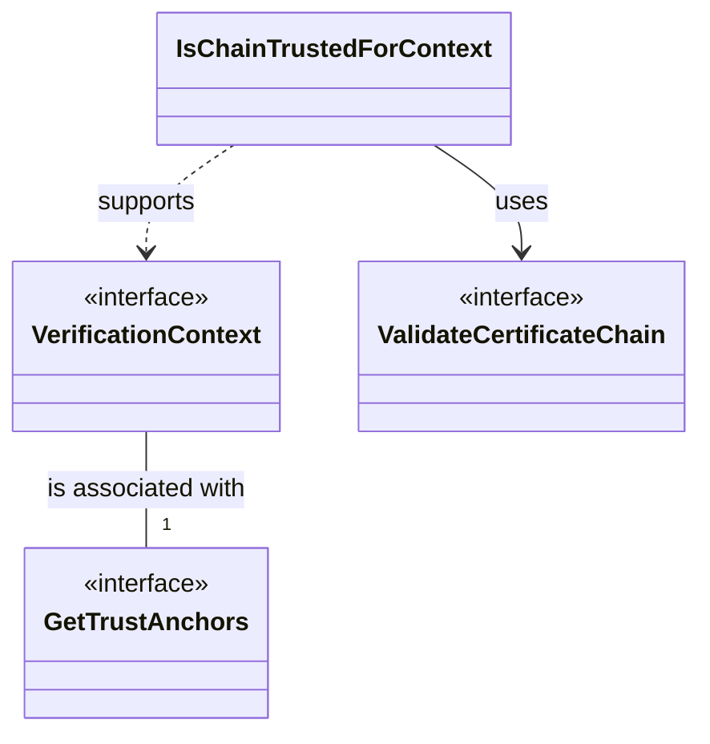

# Consultation Module

This module provides abstractions and implementations for validating certificate chains against trust anchors. 
It follows a layered approach, from high-level context-aware validation specific to EUDI Wallet 
to low-level chain validation.

## Key Components

### IsChainTrustedForContext

`IsChainTrustedForContext` is the high-level entry point for certificate chain validation. 
It uses a `ValidateCertificateChain` instance and a mapping of `VerificationContext` to `GetTrustAnchors` to determine if a given chain is trusted within a specific context.
It also supports recovery logic if a chain is not trusted initially.

### VerificationContext

`VerificationContext` is a sealed interface that defines the various scenarios where certificate validation is required. 
The following contexts are supported:

- `WalletInstanceAttestation`: For validating Wallet Instance Attestations (WIA).
- `WalletUnitAttestation`: For validating Wallet Unit Attestations (WUA).
- `WalletUnitAttestationStatus`: For validating the status of a WUA.
- `PID`: For validating Person Identification Data (PID).
- `PIDStatus`: For validating the status of a PID.
- `PubEAA`: For validating Public Electronic Attestation of Attributes (PubEAA).
- `PubEAAStatus`: For validating the status of a PubEAA.
- `QEAA`: For validating Qualified Electronic Attestation of Attributes (QEAA).
- `QEAAStatus`: For validating the status of a QEAA.
- `EAA(useCase: String)`: For validating Electronic Attestation of Attributes (EAA) for a specific use case.
- `EAAStatus(useCase: String)`: For validating the status of an EAA for a specific use case.
- `WalletRelyingPartyRegistrationCertificate`: For validating the registration certificate of an Issuer or Verifier.
- `WalletRelyingPartyAccessCertificate`: For validating the access certificate of an Issuer or Verifier.
- `Custom(useCase: String)`: For any other custom verification context.

### GetTrustAnchors

`GetTrustAnchors` is a functional interface responsible for retrieving a list of trust anchors.

### ValidateCertificateChain

`ValidateCertificateChain` is a low-level abstraction responsible for the technical validation of a certificate chain. 
It assumes that a set of trust anchors is already provided and performs 
the necessary checks (signature verification, path validation, etc.) 
to determine if the chain is valid, according to those anchors.

## Platform Support

The library provides specific implementations for JVM and Android targets:

- An implementation of `ValidateCertificateChain` based on the Java Security API.
- A factory method to obtain an `GetTrustAnchors` instance from a `KeyStore`.

